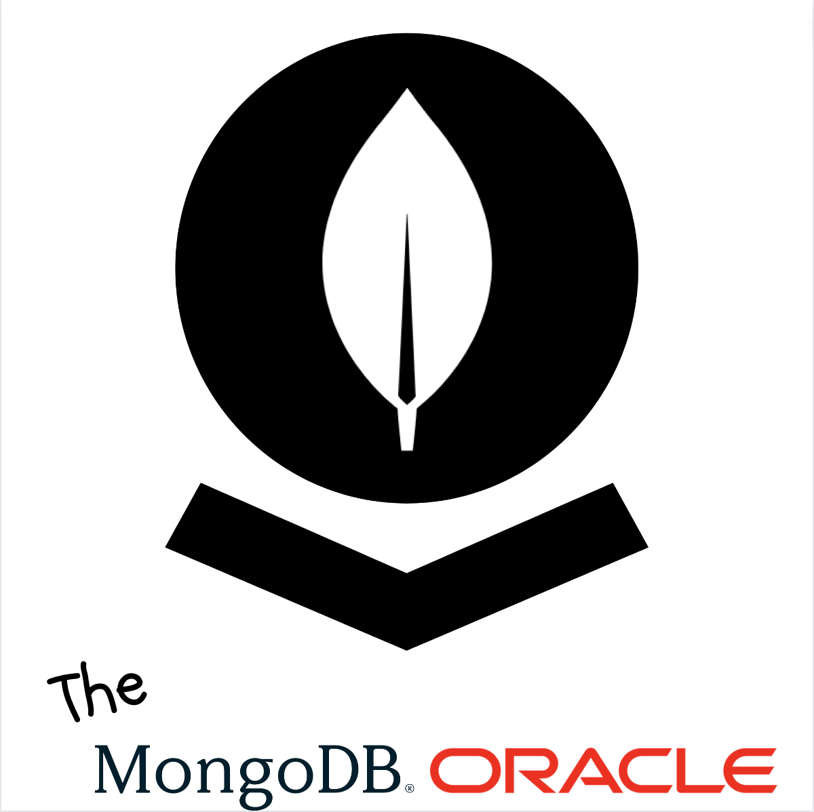
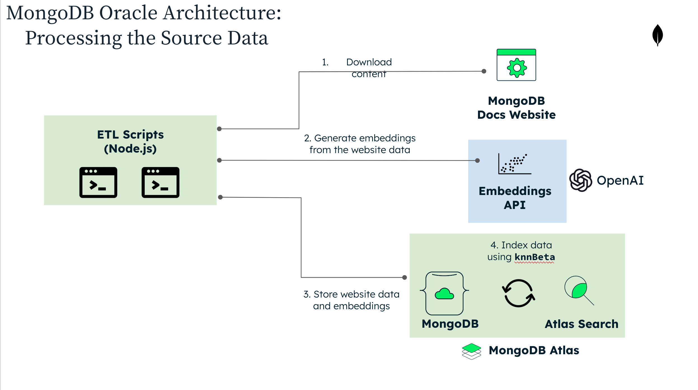
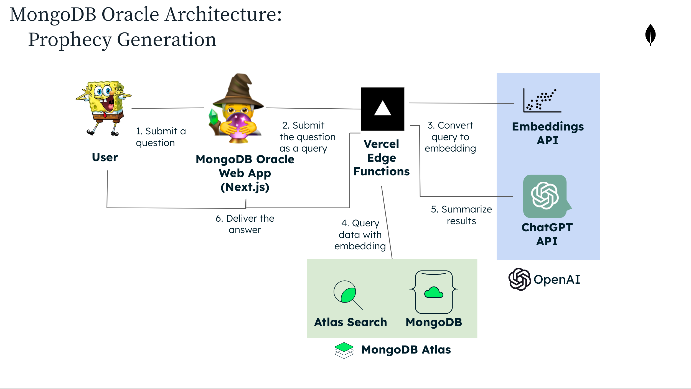

 
 

# The MongoDB Oracle

MongoDB Docs Q&A Bot. Ask it questions about MongoDB. Get answers that are _usually_ correct.

Try it out - <https://mongodb-oracle.vercel.app/>

## How It Works

The MongoDB Oracle uses AI to answer questions about MongoDB. It uses 2 AI paradigms to achieve this:
vector-based search and large language model summarization.

An indexing script creates vector embeddings for
the all the data in the [MongoDB documentation](https://mongodb.com/docs)
using the [OpenAI Embeddings API](https://platform.openai.com/docs/guides/embeddings).
These embeddings are stored along with the documentation text that the embeddings
represent in MongoDB Atlas. The data is then index in Atlas using the
[Atlas Search knnBeta](https://www.mongodb.com/docs/atlas/atlas-search/knn-beta/).

When an end user creates a question to the database, the question is converted
to an embedding using the OpenAI Embeddings API. The question's embedding is
then used to query the indexed data. Atlas Search returns the `n` most relevant results,
and links to the pages where these results came from.

These results are then passed to the OpenAI's GPT 3.5 large language model
using the [OpenAI Chat API](https://platform.openai.com/docs/api-reference/chat),
which summarizes the results formatted in Markdown.

The Markdown-formatted results are then returned to the client.

To learn more about this paradigm for AI-powered Q&A bots, refer to this article -
<https://dagster.io/blog/chatgpt-langchain>. We didn't use Langchain like this article,
but we take the same approach and use the same AI APIs.

## Architecture

### Data Ingestion

> 

### Q & A

> 

## Issues & Thoughts on Future Direction

### Current Issues

As the project currently stands, it works reasonably well. The biggest remaining issues are:

1. Vector search picks up short pieces of irrelevant data, and then feeds them to
   LLM summarization. This could be remedied by improving the quality of the data
   ingestion scripts in the `app/generate-index` directory. Improvements could include
   making sure that all embeddings cover some larger number of tokens (say >=500).
1. The ChatGPT LLM can hallucinate answers if it doesn't know the real answer.
   This is most pronounced for links, which it makes up more often than we feel
   comfortable with. This could likely be ameliorated by reducing the temperature
   for the LLM responses. Though due to the above issue of vector search sometimes
   not picking up the most relevant data, reducing the temperature currently leads
   to an unacceptable amount of 'do not know' type answers. Refining the LLM prompt
   could also probably assist with improving the answer quality.

Both of the above problems seem quite solvable. We just weren't able to address
them because we didn't have enough time in Skunkworks for it.

### Next Steps

In addition to resolving the above issues, some additional features we though about
developing but didn't have time for in Skunkworks include:

1. Alternate interfaces (Slack bot, web component, etc.)
1. Have multi-language selector so you can ask and get responses in a variety of languages.
1. 'Productize it' so people can create their own 'MongoDB Oracle'
   (probably with a different name 😅) for their own data.
1. Make the index generator pluggable, so it's easy to ingest various data sources.
1. Make the query API pluggable, so people can develop alternative interfaces.
1. Look into using/integrating [Langchain](https://github.com/hwchase17/langchain),
   a new popular library for building LLM-related projects.

## Skunkworks March 2023 MVP

The MVP to be completed during Skunkworks March 2023 (Skunkalodeon) should have the following components:

### Web Frontend

- [x] React frontend made with Leafygreen UI and Next.js
- [x] Basic chat interface (similar to text messaging app)
- [x] Query the web server backend
- [x] Run locally and deploy to web hosting (Netlify, Vercel, etc.)

Notable not doing:

- Session persistence
- Authentication
- Mobile responsive

### Web Server Backend

- [x] TypeScript/Next.js server routes with endpoint to respond to natural language user queries in natural language response
      with accurate data from the indexed site. Format answers in Markdown with links to relevant content on the site.
  - Use AI embedding API to create and query embeddings for site data. Use Atlas Search `$knnBeta` operator for this.
  - Use LLM AI to summarize results from query.
- [x] Hosting/deployment covered by whichever Next.js hosting platform decided (Netlify, Vercel, etc.)

### Index Search Data

- [x] Script(s) to index data from local machine. Use vector embedding API for this. maybe OpenAI?

### Data Layer - MongoDB Atlas with Atlas Search

- [x] Store site data in MongoDB Atlas.
- [x] Use Atlas Search with the [knnBeta](https://www.mongodb.com/docs/atlas/atlas-search/knn-beta/) to query embeddings.
- [x] Set up development and production cluster
- [x] Create script to automate index creation

### Post MVP Features

Once we finish the above MVP, some other nice features to add during Skunkworks could include:

- [ ] UI feedback on good/bad recommendations
- [ ] Multiple user interfaces. Slack bot, Discord bot, etc.
- [ ] Deployment wizard to get set up easily (similar to what we did with Atlas Static Site Search)
- [ ] Hack the UI into MongoDB nav bar.
- [ ] Endpoint(s) to index data
- [ ] Minimal API key auth (can be just static environmental variable(s))

In the end we focused on other features more, which can be seen here -
<https://github.com/mongodben/mongodb-oracle/milestone/2>

## Understand this repo

Most all the code is in the `app` directory, which is a Next.js app with some scripts in there.
